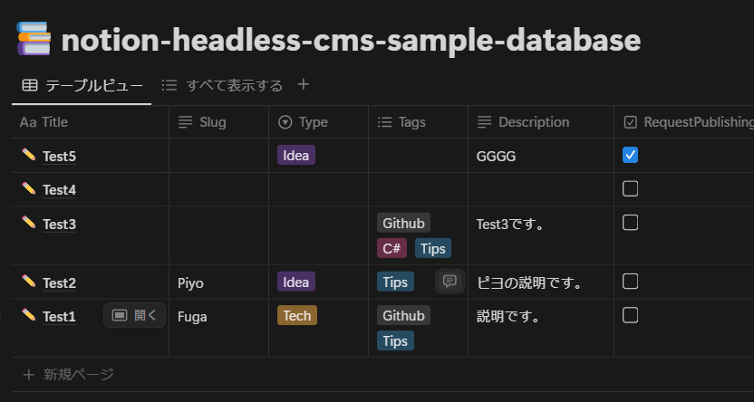

aaaaaaa
dddddd


cccccc

ddddd


[https://zenn.dev/keitakn/scraps/9641870e35b51f](https://zenn.dev/keitakn/scraps/9641870e35b51f)


## 見出し2
見出し2-1


    ```powershell
    $env:PATH += ";C:\Windows\System32"

Set-ExecutionPolicy RemoteSigned -Scope CurrentUser

iwr -useb get.scoop.sh | iex
    ```


    


---


weqweqewqw
fghfghfghf


jnjnjnjnjnjnj


* ホゲ
    * ホゲ  
      hghghghg
    * hoge
        * aaaaa
        * sssss
* ふが
    * ふが


1. aaaaasg
    1. sdsdsgg
dddddd
        * かかかか
        * たたたた
        1. はははは
        1. らららら
    1. ewewewe
        1. fdfdf
        1. ererere
1. sssssss
    1. egfgfgf


sssss

ddd
ddd


gggg


1. かかかか
1. きききき
    1. つつつつ
    1. ふふふふ
        * asadasda
        * utueht
1. んんん
1. ｋｋｋｋｋ





か  
2. きききき  
   1. つつつつ  
   2. ふふふふ  
      - asadasda  
      - utueht  
3. んんん  
4. ｋｋｋｋｋ  


